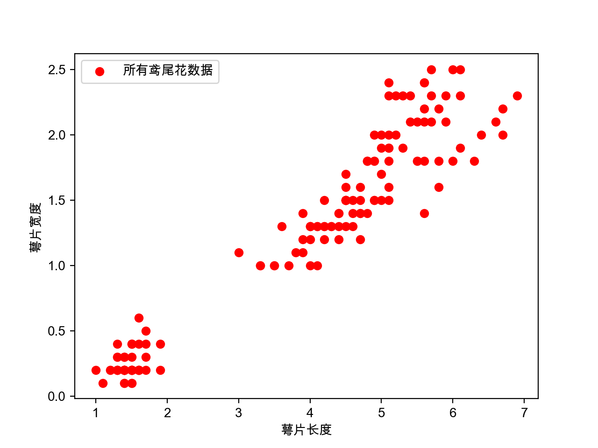
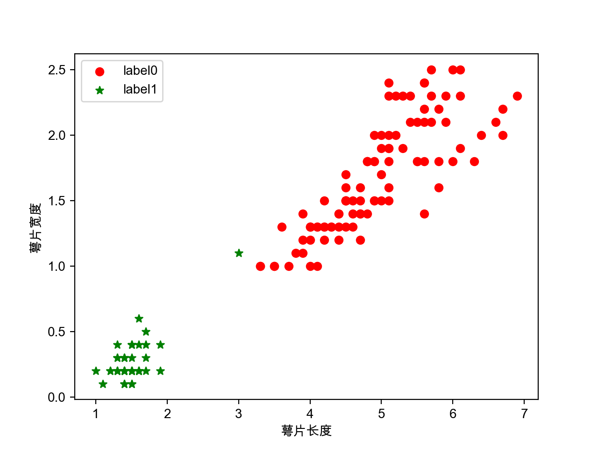

### 经典机器学习作业三：实现Kmeans聚类算法，并且和Sklearn的Kmeans比较, 使用鸢尾花数据集

### 作业代码
#### 1.  导入sklearn的鸢尾花数据集
```python
import matplotlib.pyplot as plt
import numpy as np
from sklearn.cluster import KMeans
from sklearn import datasets
iris = datasets.load_iris()
X = iris.data[:,2:4] ## 只取特征空间的最后两个维度，利于进行二维表示
print(X.shape)
plt.rcParams['font.sans-serif'] = ['Arial Unicode MS']  ## 显示中文
```
#### 2.  首先可视化鸢尾花数据集，进行整体了解

```python
plt.scatter(X[:,0], X[:,1], c="red", marker='o',label='所有鸢尾花数据')
plt.xlabel('萼片长度')  
plt.ylabel('萼片宽度')  
plt.legend(loc=2)  
plt.show() 
```

- 得到整体的鸢尾花散点分布图如下，直观上可以看出大致可以分成2个部分，左下角的小部分和右上角的大部分：


#### 3.  采用自主实现的KMEANS进行分类
```python
from sklearn.datasets import load_iris
import numpy as np
k = 2
iris = load_iris()
data = iris.data
n = len(data)
dist = np.zeros([n, k+1])
center = data[:k, :]
center_new = np.zeros([k, data.shape[1]])
while True:
    # 2、求距离
    for i in range(n):
        for j in range(k):
            dist[i, j] = np.sqrt((sum(data[i, :]-center[j, :])**2))   #欧氏距离
        dist[i, k] = np.argmin(dist[i, :k])# 3、归类
    for i in range(k):# 4、求新类中心
        index = dist[:, k] == i
        center_new[i, :] = data[index, :].mean(axis=0)
    if np.all(center == center_new):# 5、判定结果
        break
    center = center_new

print(center_new)
print(dist)
label_pred = dist[:,2]

x0 = X[label_pred == 0]
x1 = X[label_pred == 1]

plt.scatter(x0[:, 0], x0[:, 1], c = "red", marker='o', label='label0')  
plt.scatter(x1[:, 0], x1[:, 1], c = "green", marker='*', label='label1')  

plt.xlabel('萼片长度')  
plt.ylabel('萼片宽度')  
plt.legend(loc=2)  
plt.show()  
```

- 这种自己编写的算法分类结果大致是可以进行分成两个聚类的，如下图所示：


#### 4.  采用sklearn自带的KMEANS进行分类

```python
estimator = KMeans(n_clusters=2) # 构造聚类器
estimator.fit(X) # 聚类
label_pred = estimator.labels_ # 获取聚类标签
# 绘制k-means聚类结果
x0 = X[label_pred == 0]
x1 = X[label_pred == 1]

plt.scatter(x0[:, 0], x0[:, 1], c = "red", marker='o', label='label0')  
plt.scatter(x1[:, 0], x1[:, 1], c = "green", marker='*', label='label1')  
 
plt.xlabel('萼片长度')  
plt.ylabel('萼片宽度')  
plt.legend(loc=2)  
plt.show() 
```

- 这种自带的软件包进行聚类如下图所示，可以看出，除了1个点被错误聚类以外，其余的点都基本上按照直观的感觉正确聚类成2类。


